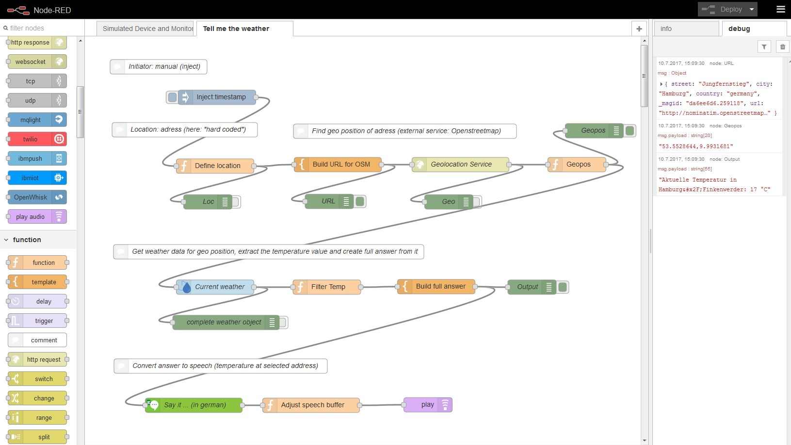
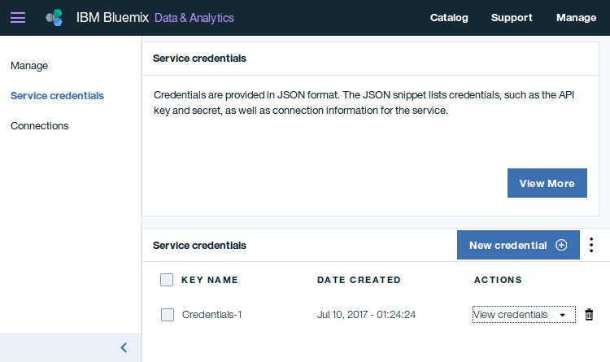

# Tell-me-the-weather
A demo of Node RED, the Weather Company Data and Watson services - all on IBM Bluemix

Author: Andreas Entgelmeier

Subject of demonstration: how to quickly create a flow in **Node RED**, and how easy it is to use the **Weather Company Data** service and a **Watson** Service for your Node RED flow.

## Prerequisite:
1.	A valid Bluemix account

## Preparation Steps:
1.	Create a *Weather Company Data* service instance from the Bluemix catalog. You may use the *free* plan.
In the service dashboard, create new credentials to access the service later. 
2.	Create a (Watson) *Text-to-Speech* service instance from the Bluemix catalog. In the service dashboard, create new credentials to access the service later. 
3.	Create an instance of the boilerplate *Internet of things Platform Starter*. You will get an application containing a NodeRed framework together with an instance of the *IoT Platform* service and a *Cloudant* database.
4.	Extend the Node RED editor’s palette by installing the node *node-red-contrib-play-audio*, which is not configured by default. See https://flows.nodered.org/node/node-red-contrib-play-audio.
An easy way to install the node for a single app instance is to select the entry *Manage Palette* in the Node RED editor’s main menu (the three bars on the top right). Then select the tab Install on the left and search for “play”. Look for the entry *node-red-contrib-play-audio* in the list and click the small *Install* button beside it. At the end – after clicking *Done*, you should see the new entry *play audio* in the palette section *Output*.

## Steps

### Part 1: get the geo position for a given address

1.	In Bluemix, open the application dashboard for the  app you got with the *IoT Platform Starter* boilerplate.
2.	Start the Node RED editor from the application dashboard (by clicking the button *Go to your Node-RED flow editor*).
3.	In the Node RED editor create a node of type *inject* (by dragging the node from the palette on the left to the canvas in the center). Open the configuration of the new node (by double-clicking it). Set the config to:

| Parameter |	Value |
| --------- | ----- |
| Payload	  | timestamp |
| Topic	    | Inject |
| Repeat |	None |

Leave the rest unchanged.

4.	In a similar way, create a node of type *function*. Link its input pin to the output pin of the first node *Inject timestamp*. Click and drag from one nodes output pin (the small circle on the right of the node icon) to the other nodes input pin (the small circle on the left of the node icon) to create the link. Now configure it to:

| Parameter |	Value |
| --------- | ----- |
| Name	| Define location |
| Function |	`msg={   street: "Jungfernstieg",  city: "Hamburg",  country: "germany"  };    return msg;` |

At runtime. this creates an JSON object, that sets the address as an input for the flow. Of course, you may use another address, if you want.

5.	Optional: create a *debug* node, and link its input to the output of the second node (*Define location*). Now configure the debug node to show the entire *msg* object, which is produced by the *Define location* node:

| Parameter |	Value |
| --------- | ----- |
| Output |	Complete msg object |
| To |	debug tab |
| Name |	Loc |

At runtime, the debug output can be monitored in the debug frame on the right side of the Node RED editor. 
 
6.	You now want to do an http request on an external service to get the geo position in terms of longitude and latitude for the address, that comes with the msg object. The according node can work with an URL, that is provided in the msg object, too. To prepare that, first create a *template* node and link it to the previous node *Define location* (not the *debug* node! :blush:  ). Configure the node to:

| Parameter |	Value |
| --------- | ----- |
|Name |	Build URL for OSM
| Set property |	msg.url |
| Template |	`http://nominatim.openstreetmap.org/search?q={{street}},+{{city}},+{{country}}&format=json` |
| Format | 	Mustache template |

The template will then be constructed from the static parts (the URL, etc.) and the parameters provided in double *{{}}*, e.g. *street*, *city* and *country*. Their actual values will be provided at runtime by the previous node via the *msg* object. 

Optionally you may again create and connect another *debug* node "URL" to print out the constructed URL as an output of this node. Refer to step 5. above.

7.	Create an *http request* node and link it to its predecessor, the template node *Build URL for OSM*. Configure it to:

| Parameter |	Value |
| --------- | ----- |
| Method |	GET |
| Return |	A parsed JSON object |
| Name |	Geolocation Service |

Leave all other parameters unchanged, especially the *URL* parameter. This node takes the URL to call from the input *msg* object instead.

8.	The previous *http request* object returns a complex *msg* object. To extract the interesting part from it, the values for latitude and longitude, create another *function* object and link it to the *http request* object. Configure it to

| Parameter |	Value |
| --------- | ----- |
| Name |	Geopos |
| Function | 	`msg.payload=msg.payload[0].lat+","+msg.payload[0].lon; return msg;` |

### Part 2: get the current weather for the location

9.	With the obtained geo position, you can now call the *Weather Company Data* service, which you instantiated during the preparation. Fortunately, there is a node type *Weather Insights* in the palette, that allows to directly call the weather service. Create a node of type *Weather Insights* and link it to the previous *Geopos* node. Configure it to:

| Parameter |	Value |
| --------- | ----- |
| Name |	Current weather |
| Username |	\<take this value from the credentials of your Weather Company Data service instance\> |
| Password |	\<take this value from the credentials of your Weather Company Data service instance\> |
| API Host |	\<take this value from the credentials of your Weather Company Data service instance\>  |
| Service |	Current observations |
| Units |	Metric |
| Language |	\<Select your preferred language here. Use a language code, e.g. en-US for US english or de for german. See the [Weather Company Data service documentation](https://console.bluemix.net/docs/services/Weather/index.html) for more details.\> |

Note: to provide this node access to your prepared weather service, you have to put in the according values for *Username* and *Password*. You can find these values in the dashboard of your service instance, in the tab *Service Credentials*. See the attached screenshot. If you created the credentials in the preparation, you will see them now, when clicking on View credentials. 

Optionally create and connect another *debug* node to watch the output of the *Current Weather* node.

10.	To extract the temperature from the weather services output, create another function object and link it to its predecessor (just as before). Configure it to:

| Parameter |	Value |
| --------- | ----- |
| Name |	Filter Temp |
| Function |	`msg={  temp: msg.observation.temp,  city: msg.observation.obs_name}; return msg;` |

11.	Again, a *template* node can now be used to build up a complete answer sentence including the temperature and city values extracted by the previous node. Create and link the *template* node and configure it to:

| Parameter |	Value |
| --------- | ----- |
| Name |	Build full answer |
| Set property |	msg.payload |
| Template |	`Current Temperature in {{city}}: {{temp}} °C` | 
| Format | 	Mustache template |

Note: you may want to change the text in the *Template* parameter to your preferred language.

To print out the complete answer, you may insert another *debug* node here. It should print the *msg.payload*.

### Part 3: Speak out the answer

12.	Now it's time to use a Watson service. It shall convert the complete answer to speech, which can then be played via your computer's speakers. First, create a node of type *text-to-speech* (from the palette's *Watson* category) and link it to the output of the node *Build full answer*. 
Open the new node and uncheck the checkbox *Use Default Service Endpoint*. Then complete the configuration to:

| Parameter |	Value |
| --------- | ----- |
| Name |	Say it ... (in \<language\> \* ) |
| Username | \<take this value from the credentials of your Text-to-Speech service instance\>| 
| Password |	\<take this value from the credentials of your Text-to-Speech service instance\> |
| Language |	\<Select your preferred language here. \> |
| Voice |	\<Select your preferred voice here. \> |
| Format |	WAV |

\* replace  \<language\> by your preferred language

**Notes:** 
* due to a "surprising feature" of the UI, it might be neccessary to switch the *Language* entry to another (arbitrary) value and back to the desired setting, until you will see valid choices in the *Voice* drop-down.
* If you check *Place output on msg.payload*, you can skip the next step (13).

13.	Create and connect another *function* node to reorder parameters in the *msg* object again. Configure it to:

| Parameter |	Value |
| --------- | ----- |
| Name |	Adjust speech buffer |
| Function |	`return {payload:msg.speech};` |

14.	The last node you create, will be a node of type *play audio*. It is only visible in the palette, if you installed the extra Node RED node type *node-red-contrib-play-audio* before, as described in the preparation steps. This node takes the audio file generated by the Watson *text-to-speech* service and plays it directly from the Node RED framework on your computer's speakers. Ah yes, don't forget to link it to the previous node *Adjust speech buffer*.

15.	After the flow is defined completely, you have to deploy it to the Node RED framework. In the upper right corner of the editor, press the Button *Deploy*. Now the code can be executed. 

16.	Trigger the flow by clicking the small rectangle on the left side of the first node *Inject timestamp* in your flow. You will see a small circle running through your sequence of nodes to indicate, which node is currently executed. At the end the answer is played via your speakers.

